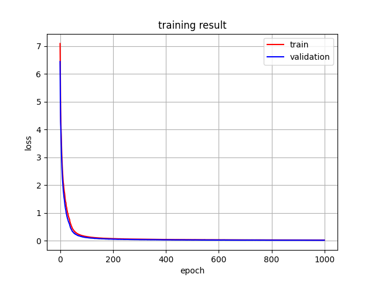
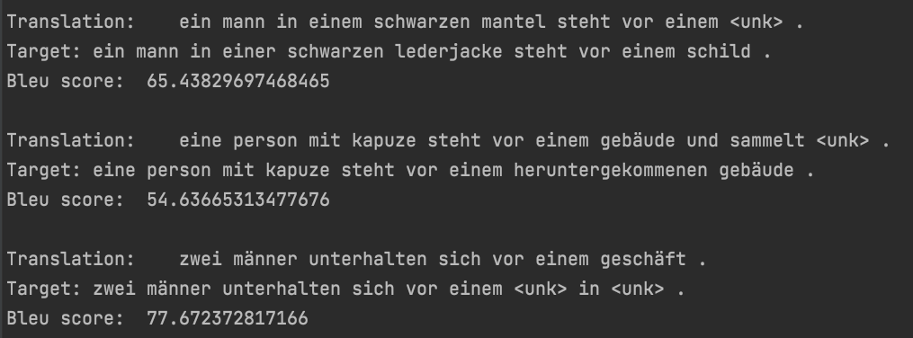

# 2022_the_annotated_transformer

# Goal

This Repository is an up-to-date version of Harvard nlp's Legacy code and a Refactoring of the jupyter notebook version as a shell script version.

# Key points

- We have re-factored Harvard NLP's Annotated Trasformer into a shell script version.

- Dataset utilized Multi30K. (The dataset is small, so you can see the results quickly even on computers with low specifications.)

- We provide the Colab version along with the shell script version, making it easy to modify the model and test the method.

  https://colab.research.google.com/drive/1SrRmC_Ti8IepeHFNBZBjNxl_wkTSJReC?usp=sharing

- Loss Graph can be drawn.

- BLEU Score can be measured.

# file structure

├── config.py
├── data.py
├── graph.py
├── models

│   ├── __init__.py

│   ├── blocks

│   │   ├── __init__.py

│   │   ├── decoder_layer.py
│   │   ├── encoder_layer.py
│   ├── embedding
│   │   ├── __init__.py
│   │   ├── positional_encoding.py
│   │   └── token_embedding.py
│   ├── layers
│   │   ├── __init__.py
│   │   ├── layer_norm.py
│   │   ├── multi_headed_attention.py
│   │   ├── position_wise_feed_forward.py
│   │   └── sublayer_connection.py
│   ├── model

│   │   ├── __init__.py

│   │   ├── decoder.py
│   │   ├── encoder_decoder.py
│   │   ├── encoder.py
│   │   ├── generator.py
│   └── util.py
├── README.md
├── result
│   ├── loss_graph.png
│   ├── train_loss.txt
│   └── valid_loss.txt
├── saved
├── test.py
├── train.py
└── utils

​    ├── __init__.py

​    ├── batch.py
​    ├── batch_size_fn.py
​    ├── bleu.py
​    ├── data_loader.py
​    ├── epoch_time.py
​    ├── greedy_decode.py
​    ├── label_smoothing.py
​    ├── make_model.py
​    ├── NoamOpt.py
​    ├── run_epoch.py
​    ├── simple_loss_compute.py
​    └── tokenizer.py

# Training Result

## Train Validation loss graph

## Test set(unseen data) Translation Example

Test set(unseen data) BLEU Score Average: 35.870847920953594

# Reference

https://nlp.seas.harvard.edu/2018/04/03/attention.html

https://jalammar.github.io/illustrated-transformer/

https://www.facebook.com/groups/TensorFlowKR/permalink/1618169785190740/

https://github.com/hyunwoongko/transformer